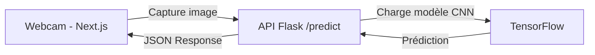

# 🧠 Emotion Detector — CNN + Flask + Next.js

## 📘 Description du projet
**Emotion Detector** est une application web complète qui utilise un **modèle de Deep Learning (CNN)** pour analyser une image de visage et prédire l’émotion d’une personne en temps réel via la webcam.

Ce projet combine :
- 🧩 **IA / Deep Learning** (TensorFlow + CNN)
- ⚙️ **Backend API Flask**
- 🎨 **Frontend Next.js + Tailwind CSS**
- 📸 **Webcam en direct** pour la détection des émotions

---

## 🧠 Partie 1 — Le Modèle IA (CNN)

### 🔍 Objectif
Le modèle de deep learning est entraîné pour reconnaître 7 émotions humaines de base à partir d’images de visages :
- 😄 **Happy**
- 😢 **Sad**
- 😡 **Angry**
- 😨 **Fear**
- 😲 **Surprise**
- 😐 **Neutral**
- 🤢 **Disgust**

---

### 🧾 Dataset utilisé — FER2013

- **Nom :** [FER2013 Facial Expression Recognition Dataset](https://www.kaggle.com/datasets/msambare/fer2013)
- **Taille :** Environ 35,000 images en niveaux de gris (48x48 pixels)
- **Structure :**
  ```
  fer2013/
  ├── train/
  │   ├── angry/
  │   ├── disgust/
  │   ├── fear/
  │   ├── happy/
  │   ├── neutral/
  │   ├── sad/
  │   └── surprise/
  └── test/
      ├── angry/
      ├── disgust/
      ├── ...
  ```
- **Format :** chaque image représente un visage exprimant une émotion.

---

### 🧮 Architecture du Modèle CNN

Le modèle est basé sur un **réseau de neurones convolutifs** (CNN) simple mais efficace pour la classification d’images.

```python
model = Sequential([
    Conv2D(32, (3,3), activation='relu', input_shape=(48,48,1)),
    MaxPooling2D(2,2),
    
    Conv2D(64, (3,3), activation='relu'),
    MaxPooling2D(2,2),
    
    Conv2D(128, (3,3), activation='relu'),
    MaxPooling2D(2,2),
    
    Flatten(),
    Dense(128, activation='relu'),
    Dropout(0.5),
    Dense(7, activation='softmax')
])
```

- **Optimiseur :** Adam  
- **Fonction de perte :** Categorical Crossentropy  
- **Métrique :** Accuracy  
- **Époques :** 25 (environ)  
- **Batch size :** 64  

Le modèle est ensuite sauvegardé :
```python
model.save("/kaggle/working/emotion_detector_model.h5")
```

---

### 📊 Résultats

| Métrique        | Valeur Approx. |
|-----------------|----------------|
| Accuracy Train  | ~85%            |
| Accuracy Test   | ~75%            |

---

## 🧱 Partie 2 — Backend Flask

### 📁 Structure du backend

```
emotion_detector/
│
├── back/
│   ├── app.py
│   ├── requirements.txt
│   └── emotion_detector_model.h5
│
└── front/
    └── (Next.js project)
```

---

### 📜 `requirements.txt`

```txt
flask
flask-cors
tensorflow==2.20.0
pillow
numpy
```

### ▶️ Exécution du serveur

```bash
cd back
python -m venv venv
venv\Scripts\activate
pip install -r requirements.txt
python app.py
```

Serveur accessible sur :
```
http://127.0.0.1:5000/predict
```

---

## 💻 Partie 3 — Frontend Next.js + Tailwind + Webcam

### ⚙️ Initialisation du projet

```bash
npx create-next-app@latest front
cd front
npm install react-webcam axios


### ▶️ Lancer le frontend

```bash
cd front
npm run dev
```

L’application est disponible sur :
```
http://localhost:3000
```

➡️ Clique sur **"Detect Emotion"** pour capturer une image et voir ton émotion prédite en temps réel.

---

## 🧩 Workflow global



---

## 📦 Améliorations possibles

- 🎥 Détection automatique via **OpenCV** (visage + émotion)
- 💾 Sauvegarde des prédictions dans une base de données
- 🚀 Déploiement du modèle sur **Render / Vercel / HuggingFace Spaces**
- 📈 Interface utilisateur plus avancée (historique des émotions)

---

## 👨‍💻 Auteur

**Heni Iheb**  
Full-Stack Web Developer & AI Enthusiast  
📧 Contact : [LinkedIn](#) | [Portfolio](#)

---

## 🧾 Licence

Ce projet est open-source sous licence **MIT**.
